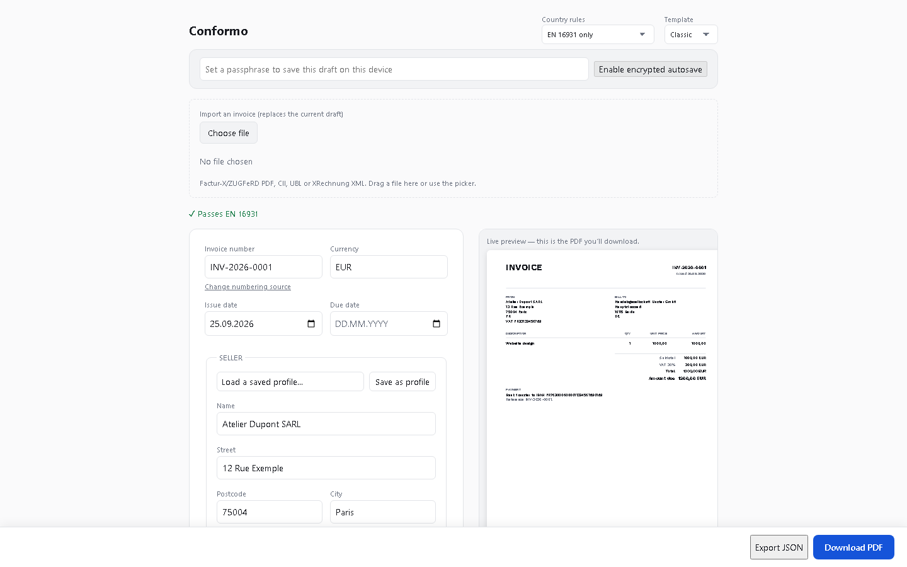

# Conformo

Free, client-side invoicing that produces the legally valid electronic
invoice your country actually requires — not just a good-looking PDF.

**[Open the app](https://conformo-three.vercel.app)** · **[Validate an invoice you already have](https://conformo-validate.vercel.app)** · **[Docs: which countries require this](https://conformo-docs.vercel.app)**

No signup, no account, no server — everything runs in your browser and your
invoice data never leaves your machine unless you choose to send it
somewhere.

<p align="center">
  
</p>

## Why this exists

France, Germany, Belgium, Poland and Italy now require — or are phasing in —
a **structured** electronic invoice, not a document that merely looks like
one. A PDF, however good-looking, is not one of those anymore. Most
invoicing tools stop at the PDF.

Conformo builds the EN 16931 semantic model first, then serializes it to
whatever your country actually needs, and embeds that structured data
**inside** a PDF/A-3 so a human still gets something readable. It validates
the result live against the official CEN Schematron and each country's own
rules, and shows you the result instead of just asserting it.

## Formats supported

- **Factur-X / ZUGFeRD** (CII) — France and Germany
- **UBL 2.1** (Invoice and Credit Note)
- **XRechnung 3.0** — Germany's public-sector format, both CII and UBL
- **Peppol BIS Billing 3.0** — the cross-border network used across the EU
- **PDF/A-3b** with the structured XML embedded, for every format above

Every format passes its official XSD and the EN 16931 Schematron; the
country-specific layers (KoSIT for XRechnung, Peppol BIS for Peppol, the
French CTC rules) are validated on top of that, never instead of it.

## Get started

**As an app** — see the links above, or run it yourself with Docker:

    docker compose up --build   # then open http://localhost:8080

**As a library (npm):**

    npm install @conformo/core @conformo/formats

```js
import { buildCII } from '@conformo/formats';

const invoice = {
  number: 'INV-2026-0001',
  typeCode: '380',
  issueDate: '2026-09-20',
  currency: 'EUR',
  seller: { name: 'Northwind Studio SARL', vatId: 'FR32123456789', street: '12 Rue Exemple', city: 'Paris', postcode: '75004', country: 'FR' },
  buyer: { name: 'Handelsgesellschaft Muster GmbH', vatId: 'DE123456789', street: 'Hauptstrasse 8', city: 'Berlin', postcode: '10115', country: 'DE' },
  lines: [{ name: 'Website design', quantity: 1, unitPriceMinor: 480000, unitCode: 'C62', taxCategory: 'S', taxRate: 20 }],
};

const xml = buildCII(invoice); // Factur-X/ZUGFeRD CII XML, ready to embed in a PDF/A-3
```

Money is always integer minor units (cents) — never floats — so the totals
never drift by the cent that gets an invoice rejected.

**As a CLI:**

    npx @conformo/cli validate my-invoice.xml --country FR
    npx @conformo/cli parse an-invoice.pdf --csv out.csv

**As an MCP server** (for agents that need to issue or check invoices):

```json
{
  "mcpServers": {
    "conformo": { "command": "npx", "args": ["-y", "@conformo/mcp-server"] }
  }
}
```

Exposes `create_invoice`, `validate_invoice`, and `convert_invoice` over
stdio.

## Which countries require this

Generated from a sourced, versioned dataset — every row cites a tax
authority, ministry, or official EU source, or is marked unverified.

<!-- COMPLIANCE-MATRIX:START -->
<!-- Generated by tools/generate-readme-matrix.ts from packages/compliance-data. Do not hand-edit; edit the source data instead. -->

| Country | B2G | B2B | Required format(s) | Last verified |
|---|---|---|---|---|
| Belgium | Mandatory (since 2023-11-01) | Mandatory (since 2026-01-01) | peppol-bis-3.0 | 2025-08-14, [source](https://ec.europa.eu/digital-building-blocks/sites/display/DIGITAL/eInvoicing+in+Belgium) |
| France | Mandatory (since 2019-11-01) | Mandatory (since 2026-09-01) | cii, ubl-2.1, factur-x | 2025-08-14, [source](https://ec.europa.eu/digital-building-blocks/sites/display/DIGITAL/eInvoicing+in+France) |
| Germany | Mandatory (since 2019-11-01) | Planned (from 2027-01-01) | xrechnung, zugferd, peppol-bis-3.0 | 2025-08-14, [source](https://ec.europa.eu/digital-building-blocks/sites/display/DIGITAL/eInvoicing+in+Germany) |
| Italy | Mandatory (since 2015-03-31) | Mandatory (since 2019-01-01) | fatturapa | 2025-08-14, [source](https://ec.europa.eu/digital-building-blocks/sites/display/DIGITAL/eInvoicing+in+Italy) |
| Netherlands | Mandatory (since 2019-11-01) | No mandate | peppol-bis-3.0, ubl-2.1, other | 2025-08-14, [source](https://ec.europa.eu/digital-building-blocks/sites/display/DIGITAL/eInvoicing+in+the+Netherlands) |
| Poland | Mandatory (since 2019-08-01) | Mandatory (since 2026-02-01) | peppol-bis-3.0, ksef-fa | 2025-08-14, [source](https://ec.europa.eu/digital-building-blocks/sites/spaces/einvoicingCFS/pages/881983593/2025+Poland+2025+eInvoicing+Country+Sheet) |
| Spain | Mandatory (since 2015-01-15) | Planned | facturae | 2025-02-04, [source](https://ec.europa.eu/digital-building-blocks/sites/pages/viewpage.action?pageId=892470070) |

<!-- COMPLIANCE-MATRIX:END -->

Full detail per country, generated from the same dataset, is at
[conformo-docs.vercel.app](https://conformo-docs.vercel.app).

## Anti-goals

This is not, and will not become, accounting, payroll, expense, inventory,
CRM, or project/time-tracking software, and it will never require an account
or a server. If that's what you need, [Akaunting](https://akaunting.com) and
[Dolibarr](https://www.dolibarr.org) already do it well.

## Contributing / building from source

See [`docs/DEVELOPMENT.md`](docs/DEVELOPMENT.md) to build, test, or run this
repo yourself, and [`CONTRIBUTING.md`](CONTRIBUTING.md) for the project's
non-negotiable invariants.

## License

Apache-2.0.
