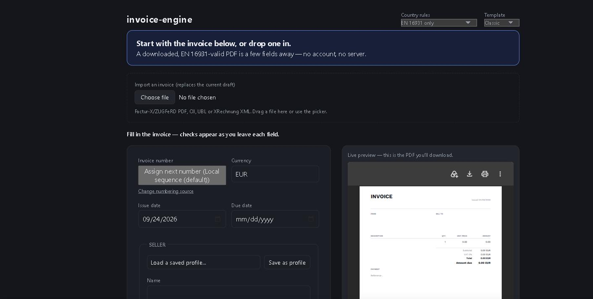
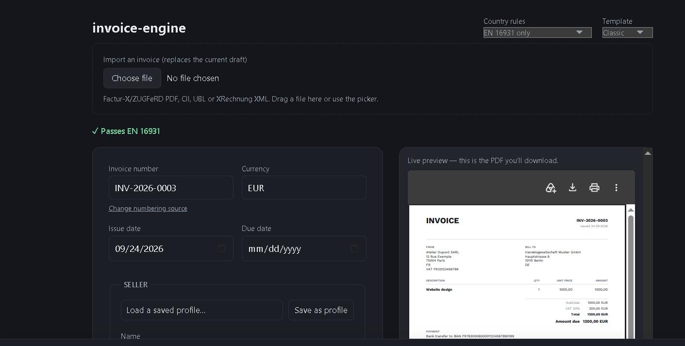

# Verinvoice

The open-source invoice tool for freelancers and small businesses selling
into the EU, where "email a PDF" is quietly becoming illegal. Verinvoice
produces the actual structured electronic invoice your country's tax
authority requires — and proves it, live, against the official rules.

  
  

<!--
Live demo: [pending — see below]
Standalone validator (no signup, checks a file you already have): [pending — see below]
-->

**Try it now, no signup, nothing installed:**

    docker compose up --build   # then open http://localhost:8080

or run it from source in three commands — see [Quick start](#quick-start)
below.

*(A hosted live demo and a standalone validator page are built and ready to
deploy — `packages/ui` and `packages/validator-page` — but not yet live at a
public URL. Docker is the fastest way to actually use it today.)*

## Why this exists

France, Germany, Belgium, Poland and Italy now require — or are phasing in —
a **structured** electronic invoice, not a document that merely looks like
one. A PDF, however good-looking, is not one of those. Most open-source
invoicing tools stop at the PDF.

Verinvoice builds the EN 16931 semantic model first, then serializes it to
whatever your country actually needs — Factur-X/ZUGFeRD, XRechnung, UBL 2.1,
Peppol BIS — and embeds the XML **inside** a PDF/A-3 so a human still gets
something readable. It then validates the result live, in your browser,
against the official CEN Schematron and each country's own rules, and shows
you the result instead of just asserting it. No account, no server: the
whole thing runs client-side, and your invoice data never leaves your
machine unless you choose to send it somewhere.

## The proof, not just the claim

| Capability | State |
|---|---|
| EN 16931 core model, exact-decimal money, tax, totals | working, tested |
| CII serializer (Factur-X / ZUGFeRD) | passes official XSD + EN 16931 Schematron |
| UBL 2.1 serializer (Invoice + CreditNote) | passes official XSD + EN 16931 Schematron |
| Peppol BIS Billing 3.0 (UBL profile) | passes EN 16931 + Peppol Schematron |
| XRechnung 3.0 (CII and UBL) | passes EN 16931 + KoSIT Schematron |
| PDF/A-3b with embedded XML | passes 25-point audit, deterministic |
| French CTC (BR-FR Flux 2) | 77 rules fired, 0 failures |
| Validator (`@verinvoice/validate`) | EN 16931 + French CTC compiled to SEF, runs client-side in a real browser — plain-language coverage below |
| CLI (`@verinvoice/cli`) | `validate` command |
| App (`packages/ui`) — live validation, encrypted local persistence, offline PWA, seller/buyer profiles, percent-of-project billing, gapless numbering, input hardening | built, each feature verified live in a real browser session (see `the project's own tracker`) |

<!-- MESSAGE-COVERAGE:START -->
<!-- Generated by tools/update-readme-coverage.ts. Do not hand-edit; edit packages/validate/src/messages/en.ts instead. -->

117 of 203 EN 16931 Schematron rules (57.6%) have a hand-written plain-language explanation — every rule a normal invoice can trigger (mandatory fields, cross-field arithmetic, every VAT-category family). The rest still get a readable message with the raw `[BR-XX]-` machine prefix stripped, never shown verbatim.

<!-- MESSAGE-COVERAGE:END -->

**Time to a downloaded invoice for a returning user: ~1.8–3.1s** (5 runs,
`e2e/measure-time-to-invoice.ts`; well inside the 10-second target). Measured
end to end against the production build — service worker warm, unlocking an
encrypted draft with a passphrase, loading a saved seller profile, filling
the buyer and one line, and downloading a PDF/A-3 invoice that passes
`tools/validate.py`. Includes real automation overhead, not a best-case
number picked after the fact.

### Compliance status by country

Generated from `packages/compliance-data`, a sourced, versioned dataset —
every row cites a tax authority, ministry, or official EU source, or is
marked unverified. Run `npm run build:compliance-data && npm run readme:matrix`
to regenerate this table after editing the dataset; never hand-edit it.

<!-- COMPLIANCE-MATRIX:START -->
<!-- Generated by tools/generate-readme-matrix.ts from packages/compliance-data. Do not hand-edit; edit the source data instead. -->

| Country | B2G | B2B | Required format(s) | Last verified |
|---|---|---|---|---|
| Belgium | Mandatory (since 2023-11-01) | Mandatory (since 2026-01-01) | peppol-bis-3.0 | 2025-08-14, [source](https://ec.europa.eu/digital-building-blocks/sites/display/DIGITAL/eInvoicing+in+Belgium) |
| France | Mandatory (since 2019-11-01) | Mandatory (since 2026-09-01) | cii, ubl-2.1, factur-x | 2025-08-14, [source](https://ec.europa.eu/digital-building-blocks/sites/display/DIGITAL/eInvoicing+in+France) |
| Germany | Mandatory (since 2019-11-01) | Planned (from 2027-01-01) | xrechnung, zugferd, peppol-bis-3.0 | 2025-08-14, [source](https://ec.europa.eu/digital-building-blocks/sites/display/DIGITAL/eInvoicing+in+Germany) |
| Italy | Mandatory (since 2015-03-31) | Mandatory (since 2019-01-01) | fatturapa | 2025-08-14, [source](https://ec.europa.eu/digital-building-blocks/sites/display/DIGITAL/eInvoicing+in+Italy) |
| Netherlands | Mandatory (since 2019-11-01) | No mandate | peppol-bis-3.0, ubl-2.1, other | 2025-08-14, [source](https://ec.europa.eu/digital-building-blocks/sites/display/DIGITAL/eInvoicing+in+the+Netherlands) |
| Poland | Mandatory (since 2019-08-01) | Mandatory (since 2026-02-01) | peppol-bis-3.0, ksef-fa | 2025-08-14, [source](https://ec.europa.eu/digital-building-blocks/sites/spaces/einvoicingCFS/pages/881983593/2025+Poland+2025+eInvoicing+Country+Sheet) |
| Spain | Mandatory (since 2015-01-15) | Planned | facturae | 2025-02-04, [source](https://ec.europa.eu/digital-building-blocks/sites/pages/viewpage.action?pageId=892470070) |

<!-- COMPLIANCE-MATRIX:END -->

13 synthetic fixtures cover reverse charge, intra-community supply, zero-rated
and exempt VAT, category O, document-level allowances/charges, a credit note,
a German public-sector invoice, a full Peppol Belgian invoice, a tax
representative, and a foreign tax-currency total. One fixture is a deliberate
negative control that proves the validator actually rejects a wrong invoice.

## What's built

- **The app** (`packages/ui`) — the editor and live preview above.
- **Sourced compliance dataset** (`packages/compliance-data`) — the table
  above.
- **Docs site** (`packages/docs-site`) — static, one page per country,
  generated from the dataset.
- **Standalone validator page** (`packages/validator-page`) — no signup,
  fully client-side, separately deployable; checks a file you already have
  against the official Schematron without importing it anywhere.
- **Docker** (`Dockerfile`, `docker-compose.yml`) — `docker compose up --build`
  serves the app on `:8080`.
- **MCP server** (`packages/mcp-server`) — `create_invoice`,
  `validate_invoice`, `convert_invoice` over stdio, for agents.

For phase-by-phase build history and verification detail, see
[`the project's own tracker`](the project's own tracker) — that is where the day-to-day project
log lives, not here.

## Quick start

    npm install
    npm run typecheck && npm run test
    npm run build:sample        # -> out/invoice.pdf + out/factur-x.xml

To run the official-schema validation you also need Python 3 (`py` on Windows,
`python3` elsewhere) and Saxon (for the XSLT-based CIUS Schematron):

    pip install factur-x pikepdf lxml saxonche
    npm run validate

To run the app locally:

    npm run schematron:compile   # compiles the validator's Schematron to SEF (gitignored, not committed)
    npm run saxonjs:fetch        # fetches the free SaxonJS browser runtime (gitignored, not committed)
    npm run dev --workspace=packages/ui

The end-to-end gate (creates a real invoice through the UI, asserts the
downloaded PDF passes `tools/validate.py`) needs a Playwright browser once:

    npx playwright install --with-deps chromium
    npm run e2e

To try it in Docker instead (builds the app and serves it on `:8080`, no
local Node/Python setup needed):

    docker compose up --build

To run the standalone validator page or the docs site on their own:

    npm run schematron:compile && npm run saxonjs:fetch   # once, for the validator page
    npm run dev --workspace=packages/validator-page
    npm run build:compliance-data && npm run docs:build   # writes packages/docs-site/dist/

To run the MCP server (`create_invoice` / `validate_invoice` / `convert_invoice`):

    npx tsx packages/mcp-server/src/server.ts

## Reading

- `CONTRIBUTING.md` is the contract for this repo. Read it before changing anything.
- `docs/pdf-traps.md` is why Factur-X generation usually fails silently.

## License

Apache-2.0.
